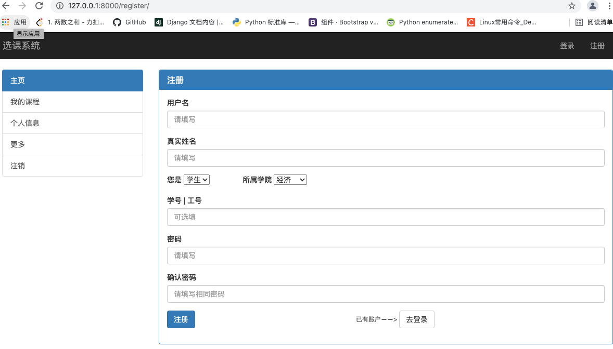
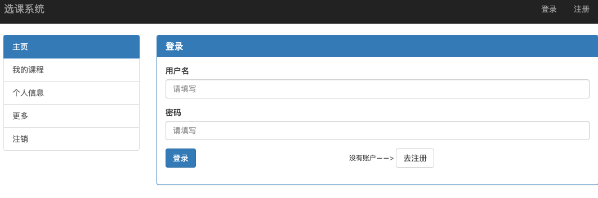
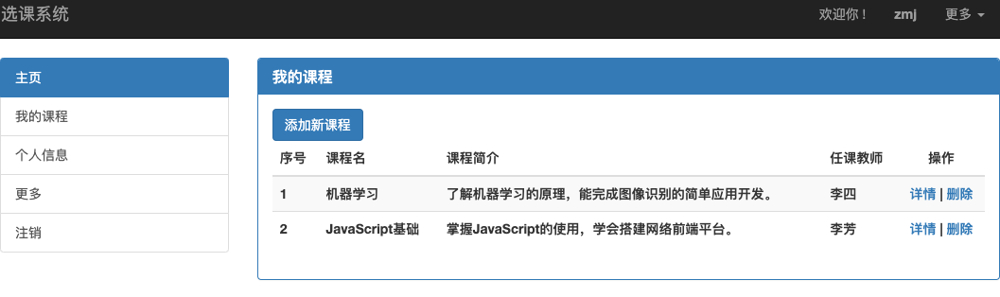
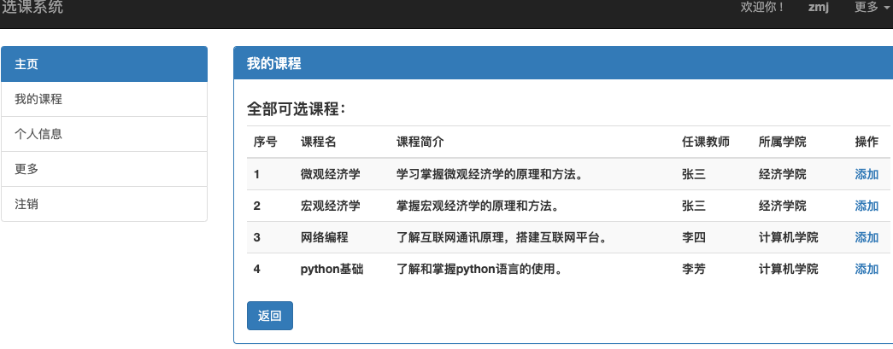
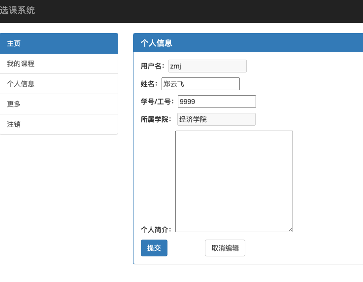
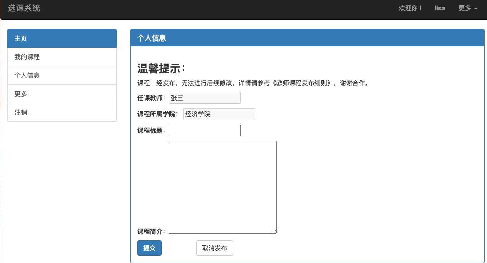

# education_djangoproject
学校选课系统案例

采用前后端不分离的开发方式，前端采用bootstrap+jquery（ajax），后端采用Django 框架。

项目主要实现功能：
1.用户注册登录及注销。2.个人信息的查询编辑和修改。3.教师发布课程。4.学生选择及修改删除课程。

页面部分功能展示如下：

1.注册页面

2.登录页面

3.学生课程的添加和删除

4.个人信息修改

5.教师课程发布

